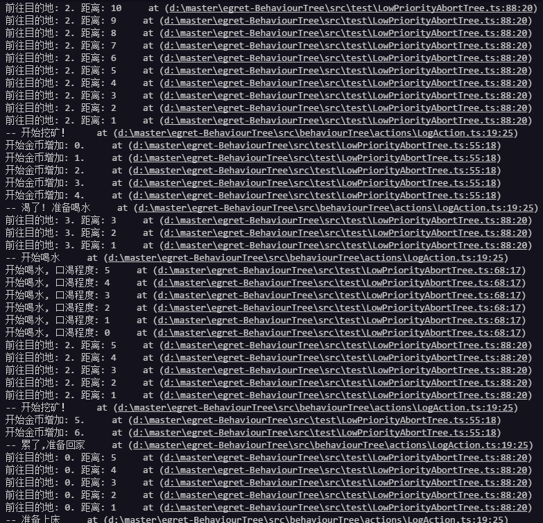

# BehaviourTree、UtilityAI、FSM
基于ecs-framework开发的AI（BehaviourTree、UtilityAI、FSM）系统，一套已经非常完整的系统。大家可以自行看源代码来学习，项目当中也有好几个示例，如果对项目你有更多的解决方案可发起 `pull request`请求或者有任何疑问可发起`issue`。

## 介绍

### State Machine
它实现 `状态作为对象` 模式。 StateMachine为每个状态使用单独的类，因此对于更复杂的系统而言，它是更好的选择。

我们开始使用StateMachine来了解上下文的概念。 在编码中，上下文只是用于满足一般约束的类。 在Array<string>中，字符串将是上下文类，即列表所基于的类。 使用所有其他的AI解决方案，您都可以指定上下文类。 它可能是您的敌人类，玩家类或包含与您的AI相关的任何信息（例如玩家，敌人列表，导航信息等）的帮助对象。

这是一个显示用法的简单示例（为简洁起见，省略了State子类）： 
  
```ts
  // 创建一个状态机，该状态机将使用SomeClass类型的对象作为焦点，并具有PatrollingState的初始状态 
  let machine = new SKStateMachine<SomeClass>( someClass, new PatrollingState() );
  
  // 我们现在可以添加任何其他状态 
  machine.addState(AttackState, new AttackState());
  machine.addState(ChaseState, new ChaseState());
  
  // 通常在更新对象时调用此方法 
  machine.update(es.Time.deltaTime);
  
  // 改变状态。 状态机将自动创建并缓存该类的实例（在本例中为ChasingState） 
  machine.changeState<ChasingState>(ChasingState);
```

### Behavior Trees
  
#### 目录结构

- src `源目录`
  - behaviourTree   `行为树主目录`
    - actions `动作是行为树的节点。比如： 播放动画，触发事件等。`
    - composites `Composites是行为树中的父节点，他们容纳一个或多个子节点，并以不同的方式执行。`
    - conditionals `它们由IConditional接口标识。它们会检查游戏世界的某些情况，并返回成功或失败`
    - decorators `装饰器可以通过各种方式修改子任务的行为，例如： 反转结果，运行知道失败等`
  - utilityAI `实用AI主目录`
    - actions `AI执行的操作`
    - considerations `列出评估和行为清单。计算一个分数，用数字表示Action的有效使用情况。`
    - reasoners `从附加的Reasoner的事项列表中选择最佳的事项。AI的根源`
  - core    `egret核心扩展`
  - test    `示例工程`
    - utilityActions `实用AI示例目录`

行为树由节点树组成。节点可以根据世界状态做出决策并执行操作。它包含一个BehaviorTreeBuilder类，它提供了一个用于设置行为树的API。BehaviorTreeBuilder是一种使行为树减少使用并快速启动的方法。

#### Composites
组合是行为树中的父节点。 他们有一个或多个子节点，并以不同的方式处理他们。 

- Sequence<T> 一旦其子任务之一返回失败，则返回失败。 如果一个子任务返回成功，它将在树的下一帧顺序运行下一个子节点
- Selector<T> 一旦其子任务之一返回成功，则返回成功。 如果子任务返回失败，则它将在下一帧顺序运行下一个子任务。 
- Parallel<T> 运行每个子节点直到子节点返回失败。它不同于Sequence仅在于它在每帧都会运行所有子节点
- ParallelSelector<T> 同Selector,除了它自身将在每帧都运行所有子节点
- ParallelSequence<T> 同Sequence,除了它自身将在每帧都运行所有子节点
- RandomSequence<T> 同Sequence，在执行前将子节点随机打乱后运行
- RandomSelector<T> 同Selector, 在执行前将子节点随机打乱后运行

#### Conditional
条件是成功/失败节点。 它们由IConditional接口标识。 他们检查您的游戏世界的某些状况，并返回成功或失败。 它们本质上是特定于游戏的，因此框架仅提供一个开箱即用的通用条件，以及包装Function的辅助条件，因此您不必为每个条件创建单独的类。 
  
- RandomProbability<T>: 当随机概率高于指定的成功率时返回成功
- ExecuteActionConditional<T>: 包装一个Func并未做Conditional执行。用于原型设计和避免为简单的条件创建单独的类。

#### Decoration
装饰器是具有单个子任务的包装器任务。 他们可以通过多种方式修改子任务的行为，例如反转结果，运行直到失败等。 

- AlwaysFail<T>: 无论子结果如何，总是返回失败
- AlwaysSuccedd<T>: 无论子结果如何，总是返回成功
- ConditionalDecorator<T>: 包装条件，并且仅在满足条件时才运行其子项。
- Repeater<T>: 重复其子任务指定次数
- UntilFail<T>: 继续执行其子任务，直到返回失败
- UntilSuccess<T>: 继续执行其子任务，直到返回成功
- Inverter<T>: 反转子结果

#### Action
动作是行为树的叶子节点。 例如播放动画，触发事件等。 

- ExecuteAction<T>: 包装一个Func并将其作为动作执行。
- WaitAction<T>： 等待指定的时间
- LogAction<T>：将字符串记录到控制台用于调试。
- BehaviorTreeReference<T>:运行另一个行为树

## 游戏实例



## 使用文档

```typescript
class AiComponent{
    private _tree: BehaviorTree<AiComponent>;
    public state: State = new State();
    private _distanceToNextLocation: number = 10;
    public update(){
        if (this._tree)
            this._tree.tick();
    }

    public start(){
        let builder = BehaviorTreeBuilder.begin(this);

        builder.selector(AbortTypes.Self);

        // 睡觉最重要
        builder.conditionalDecoratorR(m => m.state.fatigue >= State.MAX_FATIGUE, false);
        builder.sequence(AbortTypes.LowerPriority)
            .logAction("-- 累了,准备回家")
            .action(m => m.goToLocation(Locate.Home))
            .logAction("-- 准备上床")
            .action(m => m.sleep())
            .endComposite();

        // 喝水第二重要
        builder.conditionalDecoratorR(m => m.state.thirst >= State.MAX_THIRST, false);
        builder.sequence(AbortTypes.LowerPriority)
            .logAction("-- 渴了! 准备喝水")
            .action(m => m.goToLocation(Locate.Saloon))
            .logAction("-- 开始喝水")
            .action(m => m.drink())
            .endComposite();

        // 存钱第三重要
        builder.conditionalDecoratorR(m => m.state.gold >= State.MAX_GOLD, false);
        builder.sequence(AbortTypes.LowerPriority)
            .logAction( "--- 背包满了，准备去银行存钱." )
            .action( m => m.goToLocation( Locate.Bank ) )
            .logAction( "--- 开始存钱!" )
            .action( m => m.depositGold() )
            .endComposite();

        // 赚钱最后
        builder.sequence()
            .action(m => m.goToLocation(Locate.Mine))
            .logAction("-- 开始挖矿！")
            .action(m => m.digForGold())
            .endComposite();

        builder.endComposite();

        this._tree = builder.build();
    }

    private digForGold(): TaskStatus{
        console.log(`开始金币增加: ${this.state.gold}.`);
        this.state.gold++;
        this.state.fatigue++;
        this.state.thirst++;

        if( this.state.gold >= State.MAX_GOLD )
            return TaskStatus.Failure;

        return TaskStatus.Running;
    }

    private drink(): TaskStatus{
        console.log(`开始喝水, 口渴程度: ${this.state.thirst}`);

        if( this.state.thirst == 0 )
            return TaskStatus.Success;

        this.state.thirst--;
        return TaskStatus.Running;
    }

    private sleep(): TaskStatus{
        console.log(`开始睡觉, 当前疲惫值: ${this.state.fatigue}`);

        if (this.state.fatigue == 0)
            return TaskStatus.Success;
        
        this.state.fatigue--;
        return TaskStatus.Running;
    }

    private goToLocation(location: Locate): TaskStatus{
        console.log(`前往目的地: ${location}. 距离: ${this._distanceToNextLocation}`);

        if (location != this.state.currentLocation){
            this._distanceToNextLocation--; 
            if (this._distanceToNextLocation == 0){
                this.state.fatigue ++;
                this.state.currentLocation = location;
                this._distanceToNextLocation = Math.floor(Random.range(2, 8));
                return TaskStatus.Success;
            }

            return TaskStatus.Running;
        }

        return TaskStatus.Success;
    }

    private depositGold(): TaskStatus{
        this.state.goldInBank += this.state.gold;
        this.state.gold = 0;

        console.log(`存钱进入银行. 当前存款 ${this.state.goldInBank}`);

        return TaskStatus.Success;
    }
}
```

```typescript
class State{
    public static MAX_FATIGUE: number = 10;
    public static MAX_GOLD = 8;
    public static MAX_THIRST = 5;

    public fatigue: number = 0;
    public thirst: number = 0;
    public gold: number = 0;
    public goldInBank: number = 0;
    public currentLocation: Locate = Locate.Home;
}

enum Locate{
    Home,
    InTransit,
    Mine,
    Saloon,
    Bank
}
```

这两个文件是主要行为树文件。最后只需要在主文件当中进行实例化 `AiComponent`. 

```typescript
this.aiComponent = new AiComponent();
this.aiComponent.start();
```

并且对egret当中`egret.Event.ENTER_FRAME`进行监听。让行为树系统进行每帧更新

```typescript
this.aiComponent.update();
```

### GOAP
GOAP与其他AI解决方案有很大的不同。 使用GOAP，您可以为计划者提供AI可以执行的动作，当前世界状态和所需世界状态（目标状态）的列表。 然后，GOAP将尝试找到一系列将AI达到目标状态的动作。

它由一个GOAP和一个只有3种状态的状态机组成：GoTo，Animate，UseSmartObject。
  
#### ActionPlanner
相当于大脑。 您将所有的动作，当前的世界状态和目标状态交给ActionPlanner，它将为您提供实现目标状态的最佳方案。 
  
#### Action
动作定义了所需的前提条件列表以及执行动作时将发生的后置条件列表。 
  
#### Agent
代理是封装AI代理的帮助程序类。 它保留了可用操作的列表以及对ActionPlanner的引用。 代理是抽象的，需要您定义`getWorldState`和`getGoalState`方法。 有了这些计划，获得计划就像调用`agent.Plan()`一样简单。 
  
### Utility Based AI
游戏效用理论。 最复杂的AI解决方案。 最适合在其计分系统最有效的动态环境中使用。 基于实用程序的AI更适用于AI可以采取大量潜在竞争行为的情况，例如在RTS中。
  
#### Reasoner
从附加在Reasoner上的考虑因素列表中选择最佳考虑因素。一个实用AI的根。
  
#### Consideration
拥有一个评估和一个行动的列表。计算一个分数，用数字表示其行动的效用。
  
#### Appraisal
可以将一个或多个评估添加到Appraisal中。 他们计算并返回其使用代价的得分。
  
#### Action
当一个特定的考虑因素被选中时，AI执行的行动。
  
## 依赖库

[ecs-framework](https://github.com/esengine/ecs-framework)
